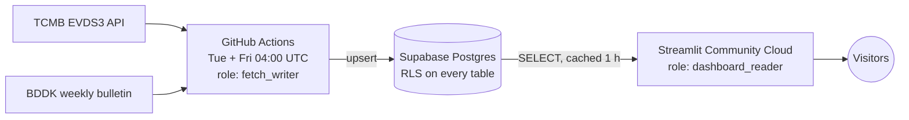

# Turkish Banking Market Dashboard

Weekly Turkish banking-sector loan data from two official sources, fetched automatically and
shown in a bilingual public dashboard.

[](https://github.com/EnesAltuNN/tr-banking-dashboard/actions/workflows/ci.yml)
[](https://github.com/EnesAltuNN/tr-banking-dashboard/actions/workflows/fetch.yml)

**Live dashboard: [tr-banking-dashboard.streamlit.app](https://tr-banking-dashboard.streamlit.app/)**
(Turkish/English)

[](https://tr-banking-dashboard.streamlit.app/)

## Highlights

- **Two official sources, cross-checked:**
  - [TCMB EVDS3](https://evds3.tcmb.gov.tr/) (the central bank's data API) and the
    [BDDK weekly bulletin](https://www.bddk.org.tr/BultenHaftalik) (the banking regulator);
    13 weekly series in total.
  - BDDK history goes back to **2014**.
  - Where both sources cover the same item, they agree within **about 0.3%**.
- **Automatic, and loud when it breaks:**
  - GitHub Actions fetches every Tuesday and Friday.
  - If a source stops publishing, a freshness check turns the run red instead of passing
    quietly.
- **Security:**
  - Row Level Security is on every table, and the Supabase REST API is closed.
  - The dashboard connects with a read-only role.
  - The scheduled job uses a least-privilege writer that cannot delete data or change the
    schema.
  - Public workflow artifacts are scanned for secrets before upload.
- **Bilingual dashboard:**
  - TR/EN switch, with Turkish number formats (`18.445,2`, `-1,1%`).
  - Weekly and yearly change, and one chart per series.
  - A one-hour shared cache keeps the public page light on the database.
- **Tested:** 230+ tests. CI runs them against a real Postgres 17 container, including tests
  that prove what each database role can and cannot do.

## Architecture



- **One data model for every source.** Each source client returns the same
  `(code, date, value)` rows, and one repository layer stores them. The same code runs on
  SQLite locally and on Postgres in the cloud.
- **Series are configuration, not code.** They live in
  [`config/series.yaml`](config/series.yaml).
- **The owner stays offline.** The database owner is used only one-off, by hand, for schema
  migrations; the scheduled job only checks that none is pending.

## Quick start

Runs locally on SQLite with BDDK data, which needs no API key. Requires
[uv](https://docs.astral.sh/uv/).

PowerShell:

```powershell
git clone https://github.com/EnesAltuNN/tr-banking-dashboard.git
cd tr-banking-dashboard
uv sync
uv run tr-banking backfill --start 2014-01-03 --source bddk
uv run streamlit run src/tr_banking/app/dashboard.py
```

bash:

```bash
git clone https://github.com/EnesAltuNN/tr-banking-dashboard.git
cd tr-banking-dashboard
uv sync
uv run tr-banking backfill --start 2014-01-03 --source bddk
uv run streamlit run src/tr_banking/app/dashboard.py
```

For EVDS data:
1. Copy `.env.example` to `.env` (`Copy-Item` in PowerShell, `cp` in bash).
2. Add a free EVDS key; [DATA_SOURCES.md](docs/DATA_SOURCES.md#tcmb-evds3-verified-2026-09-24)
   explains how to get one.
3. Run the backfill again without `--source`.

Supabase, the scheduled fetch and hosting are described in [docs/SETUP.md](docs/SETUP.md).

## Challenges & lessons learned

- **EVDS2 disappeared behind a redirect.** The central bank's old API endpoint now answers
  with a redirect to EVDS3, which also expects its parameters in the URL path without `?`.
  The client never follows redirects, because the API key travels in a header and must not be
  forwarded to another host; a redirect fails with a clear message instead.
- **Archived series are not stitched together.** The long-running EVDS loan groups were
  archived in January 2025, and their successor starts in mid-2024 with a different
  methodology. Joining them would draw one smooth line across a methodological break. The
  project keeps EVDS from 2024 and gets the long history from BDDK instead.
- **A missing TLS intermediate, fixed without `verify=False`.** `bddk.org.tr` sends only its
  own certificate. Browsers quietly download the missing intermediate, but Python on the Linux
  CI runner cannot. The public intermediate is bundled with the package and trusted next to
  certifi's roots, so verification stays on everywhere.
- **GitHub Actions has no IPv6.** Supabase's direct database host is IPv6-only, so the first
  cloud connection could not work from CI. The IPv4 session pooler solves it, and
  `tr-banking db check` warns if a connection string points to the wrong host or port.
- **Public artifacts are public.** The raw API responses are uploaded for debugging, and in
  a public repository anyone can download them. The fix has three layers: only response
  bodies are saved, echoed keys are masked, and a scan against the real secret values must
  pass before anything is uploaded.
- **Least privilege needed a split in the workflow.** The first version gave GitHub Actions
  the database owner. It now uses `fetch_writer`, which can upsert but not delete or run DDL.
  Migrations moved to a one-off manual step, and the job only checks that none is pending.
- **A public page needs a cache.** Streamlit reruns the script on every click. A one-hour
  cache shared by all visitors turns that into at most one short database read per hour. The
  page shows both the last data fetch and the time it read the database, so the cache never
  hides how old the data is.

## Roadmap

This is a learning and portfolio project. Three data modules are planned to feed one database
and one dashboard, with a weekly AI-generated summary on top.

✔ **Module 1, credit market:**
- EVDS + BDDK weekly loans.
- Supabase storage.
- Twice-weekly automatic fetch.
- Live bilingual dashboard.

Planned, in order:
1. **Real values:** inflation-adjusted series (CPI from EVDS) next to the nominal view.
2. **Loan interest rates:** the official weekly loan rates from EVDS.
3. **Module 2, card spending:** BKM monthly statistics (researched; see
   [DATA_SOURCES.md](docs/DATA_SOURCES.md#bkm-card-spending-module-2-pending-decision)).
4. **Module 3, bank rates and campaigns:** daily, from bank websites, starting with three
   banks.
5. **Weekly AI summary:** changes computed in Python; a language model only writes the text.

Other ideas:
- policy-rate decision markers on the charts;
- BDDK bank groups (state, domestic private, foreign);
- deposits and non-performing loans;
- alerts on unusual weekly changes.

## Documentation

- [docs/SETUP.md](docs/SETUP.md): local setup, CLI usage, Supabase, secrets, scheduled fetch,
  dashboard hosting, development and project layout.
- [docs/DATA_SOURCES.md](docs/DATA_SOURCES.md): sources, series codes and verified API notes.
- [docs/SECURITY.md](docs/SECURITY.md): access model, RLS and the REST API, secrets, public
  artifacts.

**Built with:** Python 3.13, uv, httpx, pandas, pydantic-settings, psycopg 3, Streamlit and
Altair, Supabase Postgres, GitHub Actions.

Data © TCMB and BDDK, fetched from their public services. This project is not affiliated with
either institution. Values are nominal TRY, and nothing here is investment advice.
