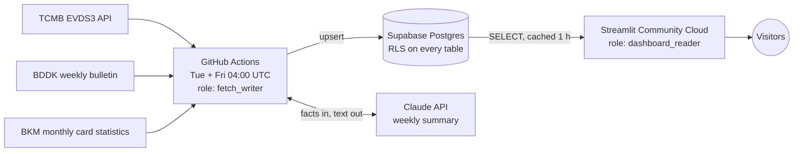

# Turkish Banking Market Dashboard

Turkish banking-market data from three public sources: weekly loans, loan and policy interest
rates, and monthly card spending. It is fetched automatically and shown in a bilingual public
dashboard, in nominal and inflation-adjusted terms.

[](https://github.com/EnesAltuNN/tr-banking-dashboard/actions/workflows/ci.yml)
[](https://github.com/EnesAltuNN/tr-banking-dashboard/actions/workflows/fetch.yml)

**Live dashboard: [tr-banking-dashboard.streamlit.app](https://tr-banking-dashboard.streamlit.app/)**
(Turkish/English)

[](https://tr-banking-dashboard.streamlit.app/)

## Highlights

- **Official sources, cross-checked:**
  - [TCMB EVDS3](https://evds3.tcmb.gov.tr/) (the central bank's data API): weekly loans, loan
    interest rates, the policy rate and CPI.
  - The [BDDK weekly bulletin](https://www.bddk.org.tr/BultenHaftalik) (the banking
    regulator): weekly loans, deposits, non-performing loans and bank groups back to **2014**.
    Where it covers the same item as EVDS, the two agree within **about 0.3%**.
  - [BKM](https://bkm.com.tr/) (the interbank card center): monthly card spending and card
    counts back to **2017**.
  - 38 series in total, all defined in one YAML file.
- **Nominal and real:**
  - One switch deflates TRY values by CPI, in the prices of the latest CPI month.
  - TÜİK moved the CPI to a new base in January 2026. A test on the real published data
    proves the new series continues the old one, so no hand-made chaining is needed.
- **Interest rates in percentage points:**
  - Loan rates and the policy rate are shown with yearly inflation as a reference line on the
    same axis.
  - Every MPC meeting is marked on the charts, holds included: the meeting calendar comes
    from the central bank's own press releases, and each decision is read from the rate.
  - The table shows an approximate real rate (rate minus inflation).
- **Automatic, and loud when it breaks:**
  - GitHub Actions fetches every Tuesday and Friday.
  - If a source stops publishing, a freshness check turns the run red instead of passing
    quietly.
- **Security:**
  - Row Level Security is on every table, and the Supabase REST API is closed.
  - The dashboard connects with a read-only role.
  - The scheduled job uses a least-privilege writer that cannot delete data or change the
    schema.
  - Public workflow artifacts are scanned for secrets before upload.
- **Bilingual dashboard:**
  - Four tabs (loans, interest rates, cards, banking sector), each opening with KPI tiles and
    sparklines; the filters sit in one box at the top of the tab.
  - The banking-sector tab computes the NPL ratio, the FX share of deposits, the
    loan-to-deposit ratio and bank-group shares on the fly from BDDK's tables.
  - Alerts flag a weekly change far outside the series' own past year (a robust score on
    the median and MAD; the threshold was calibrated on 12 years of history).
  - TR/EN switch, with Turkish number formats (`18.445,2`, `-1,1%`).
  - Light and dark themes with a color palette checked for color-vision deficiency; each
    category (housing, auto, personal, cards, commercial) keeps one color in every chart.
  - A one-hour shared cache keeps the public page light on the database, and only the open
    tab runs.
- **A weekly summary written by Claude, with the numbers kept honest:** Python computes the
  facts, the model only writes a short TR/EN text about them, and the facts are stored next
  to the text so every sentence can be checked.
- **Tested:** 380+ tests, most of them on real recorded API responses; the Claude API call is
  tested against a mocked HTTP transport. CI runs them against a real Postgres 17 container,
  including tests that prove what each database role can and cannot do.

## Architecture



- **One data model for every source.** Each source client returns the same
  `(code, date, value)` rows, and one repository layer stores them. The same code runs on
  SQLite locally and on Postgres in the cloud.
- **Series are configuration, not code.** They live in
  [`config/series.yaml`](config/series.yaml).
- **The owner stays offline.** The database owner is used only one-off, by hand, for schema
  migrations; the scheduled job only checks that none is pending.

## Quick start

Runs locally on SQLite with BDDK data, which needs no API key. Requires
[uv](https://docs.astral.sh/uv/).

PowerShell:

```powershell
git clone https://github.com/EnesAltuNN/tr-banking-dashboard.git
cd tr-banking-dashboard
uv sync
uv run tr-banking backfill --start 2014-01-03 --source bddk
uv run streamlit run src/tr_banking/app/dashboard.py
```

bash:

```bash
git clone https://github.com/EnesAltuNN/tr-banking-dashboard.git
cd tr-banking-dashboard
uv sync
uv run tr-banking backfill --start 2014-01-03 --source bddk
uv run streamlit run src/tr_banking/app/dashboard.py
```

For EVDS data:
1. Copy `.env.example` to `.env` (`Copy-Item` in PowerShell, `cp` in bash).
2. Add a free EVDS key; [DATA_SOURCES.md](docs/DATA_SOURCES.md#tcmb-evds3-verified-2026-09-24)
   explains how to get one.
3. Run the backfill again without `--source`. It loads every source, including BKM's monthly
   pages 1 s apart; this takes about 3 minutes.

Supabase, the scheduled fetch and hosting are described in [docs/SETUP.md](docs/SETUP.md).

## Challenges & lessons learned

- **EVDS2 disappeared behind a redirect.** The central bank's old API endpoint now answers
  with a redirect to EVDS3, which also expects its parameters in the URL path without `?`.
  The client never follows redirects, because the API key travels in a header and must not be
  forwarded to another host; a redirect fails with a clear message instead.
- **Archived series are not stitched together.** The long-running EVDS loan groups were
  archived in January 2025, and their successor starts in mid-2024 with a different
  methodology. Joining them would draw one smooth line across a methodological break. The
  project keeps EVDS from 2024 and gets the long history from BDDK instead.
- **A missing TLS intermediate, fixed without `verify=False`.** `bddk.org.tr` sends only its
  own certificate. Browsers quietly download the missing intermediate, but Python on the Linux
  CI runner cannot. The public intermediate is bundled with the package and trusted next to
  certifi's roots, so verification stays on everywhere.
- **GitHub Actions has no IPv6.** Supabase's direct database host is IPv6-only, so the first
  cloud connection could not work from CI. The IPv4 session pooler solves it, and
  `tr-banking db check` warns if a connection string points to the wrong host or port.
- **Public artifacts are public.** The raw API responses are uploaded for debugging, and in
  a public repository anyone can download them. The fix has three layers: only response
  bodies are saved, echoed keys are masked, and a scan against the real secret values must
  pass before anything is uploaded.
- **Least privilege needed a split in the workflow.** The first version gave GitHub Actions
  the database owner. It now uses `fetch_writer`, which can upsert but not delete or run DDL.
  Migrations moved to a one-off manual step, and the job only checks that none is pending.
- **EVDS drops rows without saying so.** A response holds at most 1000 rows, and a longer
  range quietly returns only the newest ones, with a matching `totalCount`. A policy-rate
  backfill from 2014 came back starting in 2022. The client now requests two-year windows and
  treats a 1000-row response as an error. A request that mixes weekly and monthly series is
  also silently converted to monthly, so each frequency gets its own request.
- **A CPI base change, checked instead of assumed.** In January 2026 TÜİK rebased the CPI to
  2025=100. Before using it, the new series was compared with the old one over 260 months,
  with the largest difference in monthly change at 0.007 points. A guard rejects any mixed
  index that jumps more than 20% in a month.
- **An "Excel" file that is HTML.** BKM's monthly download is an HTML table. It is parsed
  with the standard library, and every cell is found by its row and column labels, units
  included. A renamed row or a unit change fails the fetch instead of storing a wrong number.
- **A tab that forgot every second click.** Streamlit derives a widget's identity from its
  arguments. The tabs' `default` followed the open tab, so after one switch the widget was
  rebuilt and the next click went to a widget that no longer existed. The default now changes
  only with the language. The unit tests could not see it (they set state by key), so the fix
  was verified by clicking through the tabs in a real browser. The same browser check found a
  sibling: radios and multiselects keep their choice as a label, so switching to English left
  nothing selected. Translated widgets now get one key per language.
- **A public page needs a cache.** Streamlit reruns the script on every click. A one-hour
  cache shared by all visitors turns that into at most one short database read per hour. The
  page shows both the last data fetch and the time it read the database, so the cache never
  hides how old the data is.

## Roadmap

This is a learning and portfolio project. Three data modules are planned to feed one database
and one dashboard, with a weekly AI-generated summary on top.

Done:
- ✔ **Module 1, credit market:** EVDS + BDDK weekly loans, Supabase storage, twice-weekly
  automatic fetch, live bilingual dashboard.
- ✔ **Real values:** inflation-adjusted view with CPI from EVDS.
- ✔ **Interest rates:** official weekly loan rates and the policy rate from EVDS, with
  inflation reference and MPC decision markers (hikes, cuts and holds).
- ✔ **Module 2, card spending:** BKM monthly statistics from 2017 (see
  [DATA_SOURCES.md](docs/DATA_SOURCES.md#bkm-card-statistics-verified-2026-09-27)).
- ✔ **Banking sector:** BDDK deposits, non-performing loans and bank groups (state, domestic
  private, foreign), with the ratios built from them.
- ✔ **Alerts:** unusual weekly changes flagged above the tabs.
- ✔ **Weekly AI summary:** facts from Python, text from Claude, shown above the tabs.

Planned, in order:
1. **Module 3, bank rates and campaigns:** from bank websites. Postponed: research on
   2026-09-29 found that most banks show personalised rates through JavaScript calculators,
   not comparable rates in their HTML; it needs a decision on browser automation first.

Other ideas:
- the policy rate before September 2018, where the EVDS series is empty;
- a seasonally adjusted view of card spending.

## Documentation

- [docs/SETUP.md](docs/SETUP.md): local setup, CLI usage, Supabase, secrets, scheduled fetch,
  dashboard hosting, development and project layout.
- [docs/DATA_SOURCES.md](docs/DATA_SOURCES.md): sources, series codes and verified API notes.
- [docs/SECURITY.md](docs/SECURITY.md): access model, RLS and the REST API, secrets, public
  artifacts.

**Built with:** Python 3.13, uv, httpx, pandas, pydantic-settings, psycopg 3, Streamlit and
Altair, Supabase Postgres, GitHub Actions.

Data © TCMB and BDDK, fetched from their public services. This project is not affiliated with
either institution. Values are nominal TRY, and nothing here is investment advice.
